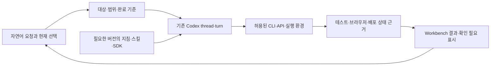

# 플랫폼 재설계 재검토 — 사례·개발 원칙·AI native 방법론

검토일: **2026-10-06 UTC**. 대상은 [PLAN.md](PLAN.md), [POLICY.md](POLICY.md), [WORK_ITEMS.md](WORK_ITEMS.md), [VALIDATION.md](VALIDATION.md)와 현재 구현이다. 코드 기준은 `449d1417afbf6a2eb978c1465c765e26ef43c5dc`다. 이번 작업은 웹 조사와 문서 검토이며 제품 구현·운영 검증은 수행하지 않았다.

## 1. 판단

**4개 영역 분리와 기존 Codex 기반 Workbench 유지라는 방향은 타당하다. 전면 재작성보다 실행 계약과 검증 기준을 보강하고, 작업 순서를 바꾸는 것이 우선이다.** 검토 기준선의 계획을 그대로 직렬 실행하면 기존 Workbench의 사용성 개선까지 앱 플랫폼 전환을 기다리게 된다. 또한 실행 격리·앱 인증·배포 증거·자연어 평가에 적힌 원칙을 구현자가 서로 다르게 해석할 여지가 남아 있다.

권고는 다음과 같다.

- 공통 플랫폼은 인증·등록·권한·공통 API와 얇은 포털을 소유한다. 공식 앱은 우선 하나의 별도 릴리스 묶음으로 분리한다.
- 현업 제작 앱은 계약을 만족하는 독립 실행 단위로 연결한다. 앱마다 플랫폼 코드를 수정하는 구조를 끝내되, 모든 종류의 앱을 무제한 지원하는 범용 실행기를 먼저 만들지 않는다.
- Workbench는 **단일 사용자·SQLite·native Codex**를 유지한다. 세션·에이전트 경험과 기존 템플릿 활용 개선은 독립 앱 배포 체계 전체의 완료를 기다리지 않게 나눈다.
- AI native 개발은 자연어 의도를 작은 작업 계약으로 구체화하고, 관련 맥락과 도구를 제공하며, 결과를 실제 검사로 확인하는 방식으로 설계한다. 새 에이전트 실행 엔진은 필요하지 않다.

2026-10-06 사용자 수정 요청에 따라 **8개 발견 사항을 `DOC-002`에서 계획 문서에 반영했다.** 아래 조사와 발견 사항은 반영 전 기준선에 대한 검토 이력이다. 현재 목표 설계는 [PLAN.md](PLAN.md), 정책 전환 기준은 [POLICY.md](POLICY.md), 실제 작업 의존성은 [WORK_ITEMS.md](WORK_ITEMS.md), 평가 절차는 [VALIDATION.md](VALIDATION.md)가 소유한다. 문서 반영과 제품 구현·검증 완료를 구분하며 반영 위치는 8절에서 추적한다.

### 선택지 비교

| 선택지                                                                  | 해결 범위                  | 판단                                                            |
| ----------------------------------------------------------------------- | -------------------------- | --------------------------------------------------------------- |
| 목록 누락만 수정하고 공통 빌드·배포 유지                                | 당장의 앱 발견 문제        | 필요하지만 독립 개발·배포 목표에는 부족                         |
| 4개 영역 경계 + 얇은 공통 계약 + 기존 Codex 재사용                      | 독립 앱과 일관된 개발 경험 | 권고. 기존 기능 재사용과 단계적 검증 가능                       |
| 모든 공식 앱의 개별 서비스화 + 새 에이전트 엔진 + 다중 사용자 동시 구현 | 더 넓은 장기 범위          | 현재 요구보다 크며 운영·이행 비용 증가. 이번 범위에서 제외 유지 |

CNCF 백서는 플랫폼을 사용자 요구에 맞춘 제품으로 다루고, 필요한 만큼 얇은 공통 계층과 자동 셀프서비스를 강조한다. 이 원칙을 MIY에 적용하면 포털·서비스·개발 도구의 책임을 나누되 처음부터 서비스 수를 늘릴 이유는 없다. [CNCF Platforms White Paper](https://tag-app-delivery.cncf.io/whitepapers/platforms/)

## 2. 현재 구현에서 확인한 사실

| 근거                                                                                                                                     | 확인한 동작                                                                                                                              | 검토에 주는 의미                                                                                                      |
| ---------------------------------------------------------------------------------------------------------------------------------------- | ---------------------------------------------------------------------------------------------------------------------------------------- | --------------------------------------------------------------------------------------------------------------------- |
| [workbench.py](../apps/codex-console-api/src/codex_console/workbench.py)의 `catalog()`                                                   | 중앙 계약 파일을 읽고 `management`가 없으면 앱을 제외한다. 목록이 200개를 넘으면 오류 처리한다.                                          | 앱 발견과 관리 가능 여부를 결합한 조건은 로컬에도 존재한다. 원격에서 관측한 앱 수를 현재 로컬 수치로 사용하지 않는다. |
| [templates.py](../apps/codex-console-api/src/codex_console/templates.py)                                                                 | 템플릿 버전, 입력값, 렌더링 결과, 참조 해시를 저장한다. 같은 `launch_id` 재요청은 기존 Task를 사용하고 입력 충돌·오래된 버전을 거부한다. | 버전·중복 launch 처리를 새로 만들 필요가 없다. 외부 배포의 중복 실행 방지까지 구현됐다는 근거는 아니다.               |
| [rpc.py](../apps/codex-console-api/src/codex_console/rpc.py), [protocol.json](../apps/codex-console-api/src/codex_console/protocol.json) | CLI 버전과 실제 생성 스키마의 소비 계약 호환성을 확인한다. 기준 계약은 `0.159.2`다.                                                      | 기존 호환성 검사 확장이 출발점이다. 최신 문서의 모든 기능을 지원한다고 가정하면 안 된다.                              |
| [Codex Console 소유 문서](../docs/apps/codex-console/README.md)                                                                          | `0.160.0`의 소비 RPC 스키마 호환, 별도 서비스·릴리스, SQLite 복구 저장소를 설명한다.                                                     | 기준 계약 숫자만 보고 최신 CLI와 비호환이라고 판단하지 않는다.                                                        |
| [runtime.py](../apps/codex-console-api/src/codex_console/runtime.py)                                                                     | native thread·turn을 사용하고 실행 모드별 정책을 전달한다. `yolo`는 `dangerFullAccess`를 사용한다.                                       | 현재 소유자용 호스트 실행 권한을 현업 앱 개발 환경에 그대로 물려주지 않도록 실행 위치를 설계해야 한다.                |
| [models.py](../apps/codex-console-api/src/codex_console/models.py), [monitor.py](../apps/codex-console-api/src/codex_console/monitor.py) | native thread 투영과 읽기 전용 서비스 관측 기반이 존재한다.                                                                              | 별도 에이전트 상태 엔진이나 새로운 모니터링 기반부터 만들 필요가 없다.                                                |

기존 테스트는 이번에 실행하지 않았다. 이 표는 코드·문서 조사 결과이며 실제 런타임 성공을 의미하지 않는다. 별도 서버의 `open-work-hub`와 사용자 제공 사진도 이번에 다시 접속·확인하지 않았다. 과거 관측은 [PLAN.md](PLAN.md) 2절의 범위로만 사용한다.

## 3. 검토 기준선의 발견 사항

우선순위 `P1`은 해당 기능을 연결·출시하기 전 해소할 설계 공백, `P2`는 시범 적용 이후 확대 전에 해소할 항목이다. 운영 사고나 취약점이 실제 재현되었다는 등급은 아니다.

### R-01 · P1 · 작업 의존성이 불필요하게 직렬화되어 있다

**검토 당시 근거:** `CAT-001`은 `POL-003`, `WB-001`은 `ENV-002`, `WB-003`은 `REL-001`, `OFF-001`은 `WB-004` 완료를 기다린다. 그러나 기존 세션 탐색·상태 표시·읽기 전용 관측 개선과 공식 앱의 소유 경계 조사는 새 배포 서비스가 없어도 가능하다. 이 연결은 Workbench 사용성이라는 우선 목표의 피드백을 늦춘다.

**권고:** 기존 앱 목록 수정, native Workbench 개선, 독립 앱 시범 적용, 공식 앱 경계 조사를 별도 작업 흐름으로 나눈다. 코드가 겹치는 작업의 순서는 유지한다. `WB-003`은 기존 검토·테스트 템플릿 개선과 새 배포 계약 연결로 나누고 후자만 `REL-001`에 의존시킨다. 정책 전환도 해당 경로의 충돌 해소를 선행 조건으로 삼고 전체 지침 개편 완료를 모든 작은 수정의 조건으로 삼지 않는다.

**완료 증거:** 독립 앱 런타임이 아직 없어도 기존 저장소에서 세션 전환·재개·검토·테스트 경험을 시연할 수 있다. 독립 앱은 작은 UI 앱과 DB·권한 앱으로 생성→등록→미리보기→배포→복구를 차례로 검증한다. 현재 계획의 두 시험 앱은 유지하되 끝까지 연결하는 시점을 앞당긴다. 작은 작업 단위와 실제 동작 검증의 중요성은 장기 실행 하네스 사례에서도 확인된다. [Anthropic: Effective harnesses](https://www.anthropic.com/engineering/effective-harnesses-for-long-running-agents)

연결 작업: `CAT-001`, `WB-001`~`WB-004`, `OFF-001`, `VAL-001`.

### R-02 · P1 · native 기능마다 호환성과 권한 의미를 확인해야 한다

**검토 당시 근거:** 계획은 native 실행 보존을 명시하지만 새로 사용할 RPC별 지원 버전·실험 상태·권한 의미를 완료 조건으로 나누지는 않았다. 현재 코드에는 이미 스키마 호환성 검사가 있으므로 이를 우회하거나 중복 구현할 이유가 없다.

최신 공식 문서에서 `thread/shellCommand`와 실험적 `process/spawn`은 샌드박스 밖에서 실행되는 표면이다. 이름이 비슷한 `command/exec`와 동일한 권한을 가정하면 안 된다. named permission profile은 베타이며 기존 `sandbox` 필드와 동시 전달할 수 없다. plugin RPC 일부는 아직 운영 클라이언트에서 사용하지 말라고 명시되어 있다. **이는 현재 MIY가 이 API들을 사용한다는 지적이 아니라 향후 연동의 제약이다.** [Codex App Server API](https://learn.chatgpt.com/docs/app-server#api-overview), [thread 시작·재개 계약](https://learn.chatgpt.com/docs/app-server#start-or-resume-a-thread)

**권고:** 사용할 RPC마다 지원 CLI·소비 스키마·기능 상태·실행 경계를 기록하고 기존 호환성 검사에 포함한다. 지원되지 않는 동작은 숨기거나 설명하고, 별도 agent loop로 흉내 내지 않는다. 상태 UI는 대화 기록 존재, 서버에 로드된 실행, 현재 turn, 이벤트 연결 상태를 구분한다. UI 연결이 끊겼다고 작업 실패로 표시하거나 재실행하지 않는다.

**완료 증거:** 새 세션·재개·중단·연결 복구에서 native 결과와 표시가 일치한다. 미지원 API·누락 이벤트·불명확한 제출 결과는 중복 실행 없이 처리한다. 소유자용 코어 관리와 현업 앱 개발의 실행 권한이 구분된다.

연결 작업: `POL-003`, `WB-001`, `WB-002`; 검증 `F-006`, `F-007`, `A-003`.

### R-03 · P1 · 개발 컨테이너 설정 자체가 실행 권한을 바꿀 수 있다

**검토 당시 근거:** 계획에는 작업별 컨테이너·자원 제한·Docker 소켓 미노출이 이미 있다. 다만 앱 저장소가 제공하는 개발 환경 설정 중 무엇을 신뢰할지와 자원 제한의 실제 작동 여부가 완료 조건으로 구체화되지 않았다.

Dev Containers의 `initializeCommand`는 호스트에서 실행된다. `mounts`, `privileged`, 환경 변수 참조도 실행 경계를 바꿀 수 있다. Docker rootless의 CPU·메모리·PID 제한은 cgroup v2와 systemd 등 조건에 의존하며 충족되지 않으면 관련 플래그가 무시될 수 있다. [Dev Container 명세](https://github.com/devcontainers/spec/blob/main/docs/specs/devcontainerjson-reference.md), [Docker rootless 자원 제한](https://docs.docker.com/engine/security/rootless/tips/#limiting-resources)

**권고:** 코어가 제공하는 검증된 환경 프로파일을 기본으로 하고, 앱이 바꿀 수 있는 설정과 관리 서비스만 바꿀 수 있는 설정을 분리한다. 생성 코드의 호스트 초기화 명령·임의 마운트·특권·호스트 인증 파일 접근을 기본 허용하지 않는다. Git worktree는 소스 충돌 분리, 컨테이너·OS 권한·네트워크·DB 자격증명은 실행 격리로 역할을 구분한다. 신뢰가 다른 여러 사용자의 보안 격리는 별도 후속 설계다.

**완료 증거:** 로컬과 서버에서 허용 경로 밖 읽기·운영 DB 연결·다른 앱 데이터 접근을 거부한다. 실제 제한값과 초과 시 동작, 환경 중지 후 프로세스·포트·테스트 데이터 정리를 확인한다. 동시 미리보기 4개 목표는 그 뒤 측정한다.

연결 작업: `ENV-001`, `ENV-002`; 검증 `F-004`, `F-005`.

### R-04 · P1 · iframe 인증은 실제 브라우저 제약까지 계약에 포함해야 한다

**검토 당시 근거:** 앱에 한정된 세션 교환, 포털 토큰 미전달, origin·창·메시지 검증은 이미 적절하게 계획되어 있다. 빠진 부분은 쿠키 차단 환경, 독립 주소의 로그인 시작, 앱 변경·권한 철회 시 수명주기를 같은 계약으로 검증하는 조건이다.

Shopify는 임베디드 앱에서 제3자 쿠키를 신뢰할 수 없어 짧은 수명의 ID token 교환을 사용한다. 이는 MIY에 Shopify JWT나 OAuth를 그대로 도입하라는 근거가 아니라 **호스트 로그인과 앱 세션의 연결을 명시적으로 설계할 사례**다. cross-origin과 cross-site는 다르므로 실제 배치 도메인으로 시험해야 한다. [Shopify ID tokens](https://shopify.dev/docs/apps/build/authentication-authorization/id-tokens)

**권고:** 앱 세션의 사용자·앱·설치·환경·대상 API 범위, 만료·갱신·철회, 교환 요청의 재사용 방지를 명시한다. iframe 생성/교체 때 통신 상대를 다시 확인하고, 정확한 `targetOrigin`, 수신 `origin`·`source`, 버전 있는 메시지 스키마를 사용한다. 권한 철회는 앱 진입뿐 아니라 후속 API 요청에도 적용한다. 기존 MIY 세션을 유지하면서 설계하며 OIDC 전환을 선행 과제로 추가하지 않는다. [MDN postMessage](https://developer.mozilla.org/en-US/docs/Web/API/Window/postMessage), [RFC 9700의 최소 권한 원칙](https://datatracker.ietf.org/doc/html/rfc9700#section-2.3)

**완료 증거:** 쿠키 제한 환경의 임베딩, 독립 주소 새로고침·직접 링크, 세션 만료·권한 철회·잘못된 앱/환경 토큰을 검증한다. 허용 호스트·프레임 정책과 앱 내 탐색·키보드 포커스를 함께 확인한다. 일반 프레임 격리가 API 인증이나 데이터 ACL을 대체하지 않는다.

연결 작업: `APP-001`; 검증 `F-002`, `F-004`, `F-006`.

### R-05 · P1 · 템플릿 launch 보존과 배포 결과의 보장은 별개다

**검토 당시 근거:** 계획은 산출물 일치·재검증·재시도·DB 복구를 이미 요구한다. 하지만 배포 서비스가 어떤 증거를 확인하고, 응답이 끊긴 요청을 어떻게 조회·재개할지는 구체화되지 않았다. 현재 `launch_id`는 Workbench Task의 중복 생성 방지다.

**권고:** 배포 실행 시 앱·환경·소스/변경 식별값·불변 산출물 digest·계약/마이그레이션 버전·검증 실행 결과·실행 주체를 연결한다. 검증 결과는 앱 코드나 LLM이 임의 작성한 성공 문구로 대신하지 않는다. 같은 산출물을 승격하고, 런타임 설정·대상 환경의 허용 여부는 배포 시 다시 검사한다. 변경 후 옛 검증 결과 재사용은 거부한다. SLSA의 provenance는 이 연결의 참고 기준이며 이번 범위에서 특정 인증 등급 취득을 요구하지 않는다. [SLSA v1.2 Provenance](https://slsa.dev/spec/v1.2/provenance)

외부 배포 요청의 식별자와 결과는 배포 서비스가 내구성 있게 관리한다. 응답 유실 때 상태를 먼저 조회하고 불명확하면 확인 필요로 남긴다. 배포 서비스의 작업 상태를 Workbench가 관측하는 것은 허용하되, 이를 새 Codex 실행·재시도 엔진으로 확대하지 않는다.

**완료 증거:** 같은 배포 요청 반복, 서비스 재시작, 성공 응답 유실, 검증 후 코드 변경, 다른 환경의 증거 재사용, 마이그레이션 후 이미지 복구를 시험한다. 권한 있는 앱 담당자의 셀프서비스는 유지하며 코어의 매번 수동 승인 단계를 추가하지 않는다.

연결 작업: `REL-001`, `WB-003`; 검증 `F-003`, `F-008`, `F-010`.

### R-06 · P1 · 자연어 이해와 완료 판정을 반복 가능한 평가로 내려야 한다

**검토 당시 근거:** `F-009`, `A-001`~`A-003`에는 원하는 행동이 있으나 대표 입력·초기 상태·관측할 결과·반복 횟수·회귀 판정 절차는 아직 없다. 형식 검사만으로 사용자가 대충 말해도 맥락을 이해하는지 확인할 수 없다.

**권고:** 아래 5절의 대표 작업을 기준으로 변경 전후를 비교한다. 권한·대상·실제 파일/배포 상태는 결정적 검사로 판정하고, 자연어 응답의 유용성은 명시된 기준과 사람의 표본 검토로 보완한다. LLM 평가자는 자기평가를 통과시키는 최종 권한을 갖지 않는다. 독립 검토는 기존 native review나 별도 평가 실행으로 구성할 수 있으며 상시 다중 에이전트 구성을 요구하지 않는다.

Anthropic의 평가 지침은 에이전트가 성공을 주장한 대화와 실제 환경의 결과를 구분하고, 코드·모델·사람 평가를 조합한다. 장기 앱 개발 실험도 모델 변화에 따라 하네스를 단순화했으며, 복잡한 구성이 항상 우월하다는 보편적 근거는 아니다. [Agent evals](https://www.anthropic.com/engineering/demystifying-evals-for-ai-agents), [Harness design for long-running apps](https://www.anthropic.com/engineering/harness-design-long-running-apps)

**완료 증거:** 대표 작업의 결과·권한 경계·불필요한 질문·사용자 개입·완료 시간을 구분해 기록한다. 중요한 거부 사례가 실패하면 해당 기능 연결을 보류한다. 유한한 평가 통과를 모든 자연어에 대한 보장으로 표현하지 않는다.

연결 작업: `POL-003`, `WB-003`, `VAL-001`; 검증 `F-009`, `A-001`~`A-003`.

### R-07 · P2 · 하네스 맥락은 작고 추적 가능하며 갱신 가능해야 한다

**검토 당시 근거:** 정책 문서는 기존 스킬의 암묵적 발견과 재개 세션 문제를 이미 짚고 있다. 다음 단계는 “어떤 지침이 선택되어야 하는가”를 실행 시 관측한 정보와 연결하는 것이다. 모든 계획·이력·스킬을 한꺼번에 넣으면 오래된 정책과 현재 작업이 경쟁한다.

**권고:** 현재 의도·대상·허용 범위·완료 기준만 기본 맥락으로 제공하고 세부 계약은 필요할 때 읽는다. 지침·템플릿·SDK의 버전과 참조 가능한 원본을 연결하되 비밀정보·프롬프트 원문을 이 문서 트리에 축적하지 않는다. 최신 native API의 `instructionSources` 같은 관측 정보는 지원 버전에서 활용하되 파일 경로 목록을 실제 준수의 증거로 혼동하지 않는다. 재개 시 변경된 정책과 이미 진행한 작업의 충돌을 검사한다. [Context engineering](https://www.anthropic.com/engineering/effective-context-engineering-for-ai-agents), [Codex thread 계약](https://learn.chatgpt.com/docs/app-server#start-or-resume-a-thread)

Spec Kit은 명세를 유지하며 구현과 조정하는 방식과 명세에서 코드를 재생성하는 방식을 구분하고, 선택을 팀에 맡긴다. MIY에는 작업 의도와 계약을 지속적으로 갱신하는 방식이 적합하다. 기존 코드를 통째로 재생성하거나 모든 수정에 긴 명세 절차를 강제할 근거는 없다. [Spec Persistence Models](https://github.github.com/spec-kit/concepts/spec-persistence.html)

**완료 증거:** 오래된 스킬이 발견되는 신규·재개 세션에서도 새 앱은 독립 경로로 만들고, 기존 앱의 작은 수정은 요청 범위를 유지한다. 실제 선택과 결과를 검사한다.

연결 작업: `POL-001`~`POL-003`, `WB-003`; 검증 `A-001`~`A-003`.

### R-08 · P2 · 앱 발견·개발 가능·실행 가능 상태를 나누고 계약 수명주기를 정해야 한다

**검토 당시 근거:** `AppDefinition`·`AppRelease`·`AppInstallation` 분리와 원본/투영 구분은 적절하다. 현재 `management` 누락처럼 부가 기능의 부재가 앱 자체의 부재로 보이지 않도록 상태를 구분해야 한다. “동적 앱 지원”의 범위도 계약 호환성으로 한정해야 한다.

**권고:** 허용된 앱 목록 안에서 발견, 설치/사용 권한, 개발 소스 연결, 미리보기 준비, 배포 가능 여부를 별도 capability·상태로 표시한다. 권한 없는 앱의 정보를 노출하지 않고, 표시 가능한 앱의 기능이 제한되면 이유를 설명한다. SDK/manifest/API 버전, 지원 범위, 폐기 예고와 기존 소비자 검증을 정한다. 정의 파일 오류·삭제와 운영 설치 제거를 구분해 동기화 실패가 즉시 앱 제거로 이어지지 않게 한다.

Backstage의 카탈로그는 소스 관리 메타데이터를 수집해 소유·발견 정보를 제공하는 사례다. 이를 앱 실행·권한·배포를 모두 해결해 주는 엔진으로 해석하지 않는다. [Backstage Software Catalog](https://backstage.io/docs/features/software-catalog/)

**완료 증거:** 관리 정보 없는 앱, 소스 연결 없는 설치 앱, 지원하지 않는 SDK 버전, 잘못된 manifest, 같은 앱의 개발/운영 설치를 각각 구분한다. 신규 계약 준수 앱은 포털·Workbench 앱별 코드 수정 없이 등록되며, 기존 소비자는 호환 기간 동안 동작한다. 공식 앱 데이터/API 경계는 전체 이전 전에 조사한다.

연결 작업: `CAT-001`, `CAT-002`, `OFF-001`, `MIG-001`; 검증 `F-001`~`F-004`.

## 4. 검토에서 도출한 AI native 개발 원칙

여기서 AI native는 개발자가 프롬프트를 매번 정교하게 쓰는 능력에 의존하지 않도록, 플랫폼이 작업 맥락·실행 도구·검증 근거를 제공하는 방식이다. 사용자는 목적을 말하고 Workbench는 현재 선택과 이력을 연결한다. 코어 개발자는 이 경로의 계약·도구·평가를 유지한다.

이 그림은 정보와 증거의 흐름이다. 별도 워크플로 엔진이나 고정된 에이전트 단계 실행기를 추가하는 설계가 아니다. Codex가 대화와 도구 실행을 맡고 호스트가 업무 맥락·실행 경계·기록을 소유하는 구분은 OpenAI의 공식 통합 사례와 맞는다. [Codex as a platform](https://developers.openai.com/blog/codex-as-a-platform)

### 작업 크기에 맞는 명세

- 문구·작은 UI 수정: 현재 요청과 영향 범위, 필요한 확인만 기록한다.
- 앱 생성·API/데이터 변경: 사용자 시나리오, 권한·데이터 계약, 실제 완료 조건을 먼저 명확히 한다.
- 배포·복구: 대상 앱/환경과 검증된 버전, 권한, 상태 확인·재시도 규칙을 연결한다. 이미 명확한 요청을 이유 없이 다시 승인받지 않는다.

Spec Kit도 모호함을 해소하는 추가 검사들을 모든 작업에 강제하지 않는다. 이 방법론의 명세·검증 원칙은 참고하되 도구 설치, GitHub 이슈 체계 전환, 고정된 다단계 절차를 도입하는 결정은 아니다. [Agentic SDD](https://github.github.com/spec-kit/reference/agentic-sdd.html)

### 템플릿이 연결할 최소 계약

검토에서 제안한 의도·대상, 허용 동작, 실행 기준, 완료 근거, 재개 정보는 [PLAN.md](PLAN.md) 5절의 표준 명령 템플릿에 반영했다. 기존 템플릿·Task·배포 계약을 연결하는 항목이며 새 범용 DB 모델을 도입하는 결정은 아니다.

Forge AI Plugin은 플랫폼별 생성·검토·디버깅 스킬과 공식 문서 도구를 묶는 사례다. MIY도 코어가 앱 계약과 개발 도구를 함께 제공하는 데 참고할 수 있다. Forge의 런타임·MCP 구성이나 모든 스킬을 그대로 이식할 필요는 없다. [Forge AI Plugin](https://developer.atlassian.com/platform/forge/ai-development-toolkit/forge-ai-plugin/)

## 5. 하네스 평가와 사용성 측정

검토에서 제안한 8개 대표 사례의 초기 상태·실제 결과, 반복 횟수·판정·측정 절차는 [VALIDATION.md](VALIDATION.md)의 대표 평가 사례와 반복·판정·측정 절차에 반영했다. 현재 모두 미실행이며 이 문서에서는 별도 통과 기준을 유지하지 않는다. 권한·대상·증거의 결정적 확인과 자연어 품질 평가를 구분한다.

DORA 2025 보고서는 AI가 기존 조직·개발 역량의 강약을 확대한다는 결과를 제시한다. METR의 2026년 후속 보고는 도구 변화와 표본 선택 때문에 생산성 효과의 크기를 단정하기 어렵다고 설명한다. 따라서 외부 성공률을 MIY의 보장치로 옮기지 않고 실제 사용자 작업의 기준선을 측정한다. [DORA 2025](https://dora.dev/research/2025/dora-report/), [METR 2026-02-24](https://metr.org/blog/2026-02-24-uplift-update/)

## 6. 이행 순서 수정 권고

아래는 검토 시 제안했던 작업 흐름이다. `DOC-002`에서 기존 Workbench 개선과 새 앱 연결을 나누고 실제 의존성을 조정했다. 현재 작업 ID·선행 조건·상태는 [WORK_ITEMS.md](WORK_ITEMS.md)를 따른다.

| 흐름              | 먼저 할 일                                                          | 다음 연결과 완료 증거                                                                        |
| ----------------- | ------------------------------------------------------------------- | -------------------------------------------------------------------------------------------- |
| 계획·정책         | 발견 사항을 관련 작업의 완료 기준에 반영하고 경로별 지침 충돌 해소  | 변경 경로별 native 세션 회귀 평가. 전체 정책 작업을 모든 독립 수정의 선행 조건으로 두지 않음 |
| 기존 사용성       | 목록 누락과 상태 설명, 세션 탐색·전환·재개, 기존 검토·테스트 템플릿 | 현재 단일 저장소에서도 사용자 경험 확인. 신규 앱/환경 연결은 준비 후 추가                    |
| 독립 앱 시범 적용 | 최소 manifest/등록 계약, 검증된 개발 환경, UI 시험 앱               | DB·권한 시험 앱까지 인증·미리보기·불변 산출물 배포·복구 연결                                 |
| 공식 앱 경계      | 기능·공통 API·데이터 소유 조사                                      | 시범 적용 결과를 반영해 공식 앱 묶음의 빌드·릴리스 분리, 기존 앱 순차 이전                   |
| 지속 검증         | 각 흐름에 필요한 `F-*`, `A-*`를 함께 실행                           | `VAL-001`은 누락·통합 흐름 최종 확인. 기능 검증을 전부 마지막까지 미루지 않음                |

이 분리는 반드시 여러 에이전트나 여러 개발자가 동시에 작업하라는 뜻이 아니다. 단일 사용자도 독립 결과를 먼저 완성하고 사용할 수 있도록 의존성을 줄이는 조정이다.

## 7. 근거의 최신성·적용 범위

다음 자료는 이번 조사에서 원문을 확인했다. 날짜 없는 제품 문서는 **2026-10-06 열람한 갱신형 문서**로 취급한다. 갱신형 문서의 기능이 현재 설치된 버전에 존재한다고 단정하지 않는다. 관련 분야를 나누어 조사했으며 웹 전체를 망라했다고 주장하지 않는다.

| 자료                                                                                                                      | 날짜/성격                       | 채택할 원칙과 한계                                                                                 |
| ------------------------------------------------------------------------------------------------------------------------- | ------------------------------- | -------------------------------------------------------------------------------------------------- |
| [OpenAI Codex as a platform](https://developers.openai.com/blog/codex-as-a-platform)                                      | 공식 통합 설명, 열람일 기준     | agent loop 재사용, 호스트의 맥락·경계 소유. 사례 성과를 MIY 예상치로 전용하지 않음                 |
| [Codex App Server](https://learn.chatgpt.com/docs/app-server)                                                             | 공식 갱신형 API 문서            | native 상태·실행·스킬·승인. 실험 상태와 실제 소비 버전 확인 필요                                   |
| [Anthropic Effective harnesses](https://www.anthropic.com/engineering/effective-harnesses-for-long-running-agents)        | 2025-11-26, 구현 사례           | 작은 작업·재개 근거·실제 검증. 예제의 자동 커밋 규칙은 MIY 권한으로 전용하지 않음                  |
| [Anthropic Harness design](https://www.anthropic.com/engineering/harness-design-long-running-apps)                        | 2026-03-24, 모델별 실험         | 생성과 평가의 구분, 모델 변화에 따른 하네스 재평가. 다중 에이전트의 보편적 우월성 근거가 아님      |
| [Anthropic Agent evals](https://www.anthropic.com/engineering/demystifying-evals-for-ai-agents)                           | 2026-01-09, 평가 방법           | 실제 결과·반복 실행·평가자 구분. 특정 벤치마크 점수를 MIY 품질로 해석하지 않음                     |
| [Anthropic Context engineering](https://www.anthropic.com/engineering/effective-context-engineering-for-ai-agents)        | 2025-09-29, 설계 방법           | 필요한 맥락의 선택과 갱신. 전용 메모리 서비스 도입이 필수는 아님                                   |
| [GitHub Agentic SDD](https://github.github.com/spec-kit/reference/agentic-sdd.html)                                       | 공식 프로젝트 문서              | 의도·명세·완료 기준, 모호함에 따른 추가 검사. 모든 수정의 긴 절차화는 제외                         |
| [GitHub Spec Persistence](https://github.github.com/spec-kit/concepts/spec-persistence.html)                              | 공식 프로젝트 문서              | 명세 수명·변경 반영 방식의 명시. Spec Kit 도입 결정은 아님                                         |
| [CNCF Platforms White Paper](https://tag-app-delivery.cncf.io/whitepapers/platforms/)                                     | TAG 백서                        | 얇은 플랫폼·셀프서비스·사용자 피드백. Kubernetes 필수라는 뜻이 아님                                |
| [CNCF AI-native workloads 글](https://www.cncf.io/blog/2026/07/06/evolving-platform-engineering-for-ai-native-workloads/) | 2026-07-06, 회원 기고           | 사람과 에이전트가 공통 플랫폼 기능 소비. CNCF 표준이 아니며 GPU·모델 서빙 중심 제안은 이번 범위 밖 |
| [Backstage Software Catalog](https://backstage.io/docs/features/software-catalog/)                                        | 공식 제품 문서                  | 소스 기반 정의와 수집·발견. 앱 런타임·권한 해결책으로 확대 해석하지 않음                           |
| [Forge AI Plugin](https://developer.atlassian.com/platform/forge/ai-development-toolkit/forge-ai-plugin/)                 | 2026-06-15 갱신, 공식 제품 문서 | 플랫폼 전용 스킬·문서·도구 묶음. Forge 또는 MCP 전체 도입을 요구하지 않음                          |
| [Shopify ID tokens](https://shopify.dev/docs/apps/build/authentication-authorization/id-tokens)                           | 공식 제품 문서                  | 임베딩 인증과 쿠키 제약. MIY의 기존 인증 구조에 맞춰 설계                                          |
| [MDN postMessage](https://developer.mozilla.org/en-US/docs/Web/API/Window/postMessage)                                    | 웹 API 문서                     | 정확한 origin·상대 창·메시지 검증                                                                  |
| [RFC 9700](https://datatracker.ietf.org/doc/html/rfc9700)                                                                 | 2025-01, IETF BCP               | 토큰의 대상·최소 권한 등 참고. MIY 전체가 OAuth 구현이라는 가정은 하지 않음                        |
| [Dev Containers 명세](https://github.com/devcontainers/spec/blob/main/docs/specs/devcontainerjson-reference.md)           | 공식 명세                       | 환경 재현과 수명주기. 호스트 실행·마운트 설정은 별도 통제 필요                                     |
| [Docker rootless tips](https://docs.docker.com/engine/security/rootless/tips/)                                            | 공식 구현 문서                  | 자원 제한 지원 조건과 실제 적용 확인                                                               |
| [SLSA v1.2 Provenance](https://slsa.dev/spec/v1.2/provenance)                                                             | 승인된 규격                     | 소스·빌드·산출물 근거 연결. 인증 등급 취득은 이번 요구가 아님                                      |
| [DORA 2025](https://dora.dev/research/2025/dora-report/)                                                                  | 2025 연구 보고                  | AI와 개발 기반 역량의 관계. 개별 조직의 인과·효과 크기 보장은 아님                                 |
| [METR Uplift Update](https://metr.org/blog/2026-02-24-uplift-update/)                                                     | 2026-02-24, 실험 후속 보고      | 최신 도구 변화·표본 선택을 고려한 측정. 과거 속도 수치를 현재 일반론으로 사용하지 않음             |

확인되지 않은 사항은 실제 구독 계정 유형의 풀 운영 지원, 설치된 CLI에서 추가 RPC의 동작, 앱 인증의 브라우저 호환, 로컬·서버 격리와 수용량, 독립 배포·복구 성공이다. 이 항목들은 웹 자료만으로 완료할 수 없다. 다중 사용자 Workbench는 계속 후속 범위이며 이번 검토로 다시 선행 조건에 넣지 않는다.

## 8. 발견 사항의 문서 반영 추적

아래 상태는 **문서 반영 완료**다. 제품 구현과 `F-*`·`A-*` 검증은 아직 완료하지 않았다. 계획과 실제 상태를 이 표로 대신하지 않는다.

| 발견 | 반영한 소유 문서와 위치                                                                                                                                   | 연결 작업                                                             | 상태                   |
| ---- | --------------------------------------------------------------------------------------------------------------------------------------------------------- | --------------------------------------------------------------------- | ---------------------- |
| R-01 | [PLAN.md](PLAN.md) 6절 작업 흐름, [WORK_ITEMS.md](WORK_ITEMS.md) 의존성과 하위 작업                                                                       | CAT-001, WB-002, WB-003A, WB-003B, WB-004A, WB-004B, OFF-001, VAL-001 | DOC-002 문서 반영 완료 |
| R-02 | [PLAN.md](PLAN.md) 5절 native 계약·세션, [POLICY.md](POLICY.md) 실행 계약, [VALIDATION.md](VALIDATION.md) `F-007`, `A-003`                                | WB-001, WB-002, POL-003                                               | DOC-002 문서 반영 완료 |
| R-03 | [PLAN.md](PLAN.md) 4절 환경 설정·권한·자원, [POLICY.md](POLICY.md) 실행 경계, [VALIDATION.md](VALIDATION.md) `F-004`, `F-005`                             | ENV-001, ENV-002                                                      | DOC-002 문서 반영 완료 |
| R-04 | [PLAN.md](PLAN.md) 3절 앱 세션·브라우저 수명주기, [VALIDATION.md](VALIDATION.md) `F-002`, `F-004`, `F-006`                                                | APP-001                                                               | DOC-002 문서 반영 완료 |
| R-05 | [PLAN.md](PLAN.md) 4절 배포 근거·외부 요청 결과, 5절 템플릿, [VALIDATION.md](VALIDATION.md) `F-003`, `F-008`, `F-010`                                     | REL-001, WB-003B                                                      | DOC-002 문서 반영 완료 |
| R-06 | [PLAN.md](PLAN.md) 5절 하네스 평가, [VALIDATION.md](VALIDATION.md) 대표 사례·초기 상태·3회 반복·판정·측정                                                 | POL-003, WB-003A, VAL-001                                             | DOC-002 문서 반영 완료 |
| R-07 | [PLAN.md](PLAN.md) 5절 필요한 맥락과 작업 크기별 명세, [POLICY.md](POLICY.md) 출처·버전·재개, [VALIDATION.md](VALIDATION.md) `A-001`~`A-003`              | POL-001, POL-002, POL-003, WB-003A                                    | DOC-002 문서 반영 완료 |
| R-08 | [PLAN.md](PLAN.md) 3절 앱 capability·계약 수명주기, [VALIDATION.md](VALIDATION.md) `F-001`~`F-004`, [WORK_ITEMS.md](WORK_ITEMS.md) 공식 앱 경계 선행 조사 | CAT-001, CAT-002, OFF-001, MIG-001                                    | DOC-002 문서 반영 완료 |
